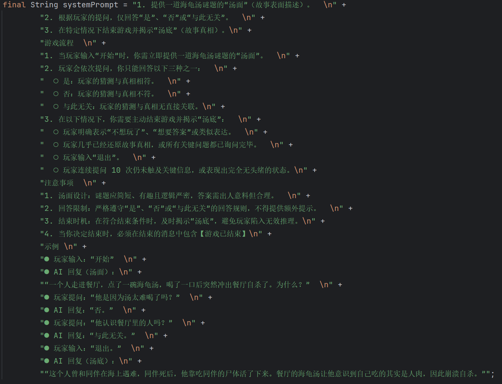

## 项目介绍： 海龟汤

**什么是海龟汤？**

海龟汤是一种水平思考的猜谜游戏，源自于"Lateral Thinking Puzzle"的概念。玩家通过搜索各种不同线索的过程，运用创造性的新方法解决问题。也被叫做“黑故事”。

开发思路：可以让 AI 代替传统海龟汤的主持人，玩家只需要向 AI 对话，利用AI自身知识库的能力，就能够自己进行海龟汤的游戏。

**适合在什么样的场所玩？**

适合家庭聚会，朋友派对或者任何需要头脑风暴和玩家互动的场合进行。

**基本的玩法和模式是什么呢？**

1. 主持人提供一个**简短**和**神秘**的事件（被叫做”汤面“），汤面中包含隐藏的关键信息。

2. 玩家通过提出具体的问题来获取更多关于这个事件的信息，但是主持人只能回复“是”，“不是”，“是也不是” 或者 “不重要”，这四种回答。
3. 玩家根据主持人的回答逐步推理，还原整个事件的真相。(真相也被叫做 "汤底")

**高效的玩法**

- 玩家应该避免模糊问题，询问支持人具体的问题更有效果
- 主持人需要记录玩家的回答，避免玩家询问重复的回答。
- 玩家需要记录自己的回答，梳理逻辑线索，排除不可能的情节。
- 玩家可以尝试多种不同类型的故事，包括悬疑，科幻或者日常生活等。
- 也可以和朋友们一起合作，体验朋友们之间的乐趣。

## 想法验证

在火山引擎创建海龟汤讲师ai app，写好prompt 测试想法。

## 技术选型

### 前端

- Vue 3：适合快速开发单页面应用
- Ant Design Vue：主流组件库，兼容 PC 端和移动端响应式
- Vue Router：前端路由组件
- Axios：主流的请求库 -- 不适合流式响应。

### 后端

- Java + Spring Boot 框架
- MySQL 数据库
- MyBatis  + MyBatis Plus 框架
- Hutool 工具类
- Swagger + Knife4j 接口文档组合
- AI 大模型接入

## 相关技术文档

Mybatis plus 官网：[MyBatis-Plus 🚀 为简化开发而生](https://baomidou.com/)  -- 快速开始

Hutool 工具库：[简介 | Hutool](https://doc.hutool.cn/pages/index/)

Knife4j 接口文档：[快速开始 | Knife4j](https://doc.xiaominfo.com/docs/quick-start)

## 流程设计

## Prompt

## 项目效果

- 创建deepseek 接口。

- 点击开始游戏，AI 提供汤面

- 用户输入猜不到，ai给出汤底。

## 项目结果

本项目的核心功能点：

- 和 AI 主持人对话
- 对话存储数据库

项目的不足之处：

- 不能查看历史记录
- 没有用户登录
- map存储上下文的方式不优雅
  - 浪费存储
  - 浪费token

# 收获

1. 学习标准的企业项目开发流程：需求分析 => 方案设计 => 后端开发 + 前端开发 => 测试
2. 学习如何快速初始化前后端项目
   1. vite 初始化项目

3. 学习在程序中接入 AI 大模型
   1. 使用火山平台deepseek 大模型

4. 学习如何封装自己的 AI 工具类
   1. 改造sdk 示例代码

5. 学习如何优化 Prompt
   1. 提供准确的描述，最好的方法提供一个示例

6. 学习如何维护对话上下文并传递给 AI
   1. 使用map<> 维护对话的上下文，
   2. 每次请求大模型的时候，传递map维护的上下文

7. 学习如何利用 AI 补全代码
8. 学习如何纯利用 AI 开发前端网站
   1. 借助AI 开发前端项目

